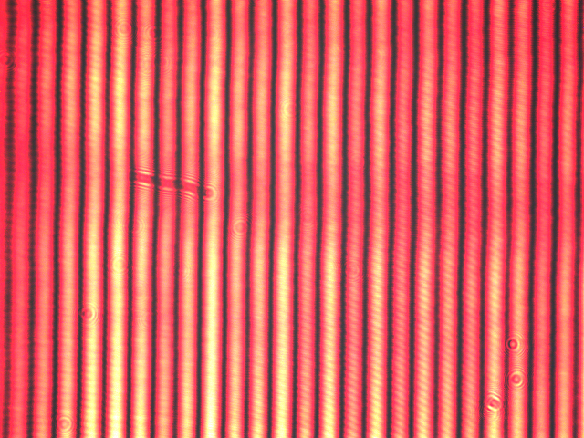
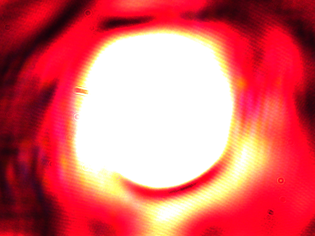
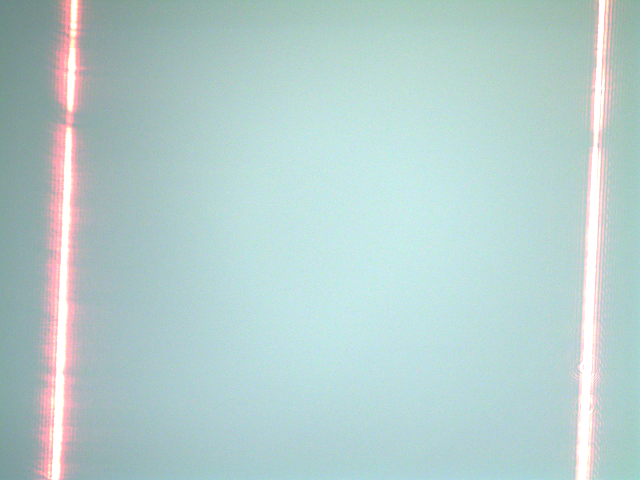
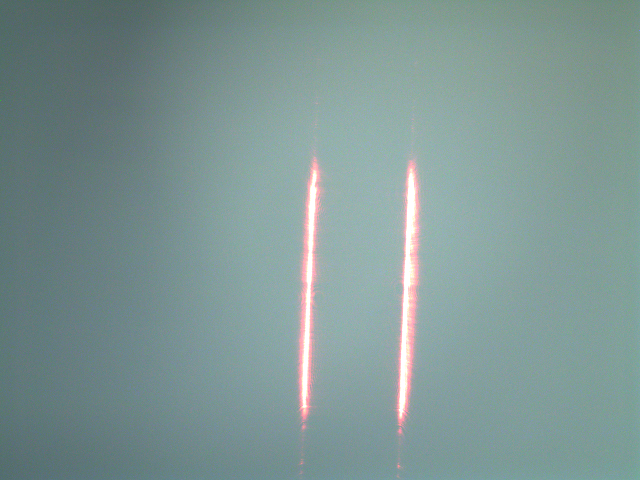

# AI 辅助菲涅尔双棱镜干涉实验

[](https://shields.io/)
[](https://shields.io/)
[](https://shields.io/)
[](https://shields.io/)
[](https://shields.io/)
[](LICENSE)

**一个基于 C++/Qt 和 OpenCV 的智能物理实验辅助系统，旨在通过计算机视觉技术简化菲涅尔双棱镜干涉实验的操作，并提高测量精度。**

---

## 目录

- [项目背景](#项目背景)
- [核心问题](#核心问题)
- [解决方案](#解决方案)
- [主要功能](#主要功能)
- [系统截图](#系统截图)
- [技术架构](#技术架构)
- [编译与运行](#编译与运行)
- [实验结果对比](#实验结果对比)
- [特色与创新](#特色与创新)
- [团队成员](#团队成员)
- [许可](#许可)

## 项目背景

菲涅尔双棱镜干涉是分波面干涉的经典范例，它深刻地验证了光的波动性，并推动了现代干涉测量技术的发展。从LIGO引力波探测器的精密调节到双棱镜摄谱仪的环境监测，其核心原理至今仍在前沿科学中扮演重要角色。

然而，作为大学物理实验的重要组成部分，菲涅尔双棱镜干涉实验因其操作的复杂性未能在各高校广泛普及。

## 核心问题

传统的菲涅尔双棱镜干涉实验面临三大挑战：

1.  **光路调节困难**：光学元件（狭缝、双棱镜）需严格共轴等高，微小偏差（>0.5mm）即会导致干涉条纹质量下降甚至消失，调节过程耗时且繁琐。
2.  **测量精度受限**：
    *   **虚光源间距 (d)**：采用共轭成像法测量，易受透镜像散和焦平面判断不准的影响。
    *   **干涉条纹间距 (Δx)**：依赖测微目镜读数，存在空程误差和主观判读偏差。
3.  **环境干扰敏感**：机械振动、气流扰动等环境因素会引起条纹漂移，影响测量稳定性。
4.  **操作风险**：长时间的调节和读数过程可能对实验者的眼睛造成激光损伤。

## 解决方案

为解决上述难题，本项目开发了一套基于 **C++/Qt** 和 **OpenCV** 的AI辅助菲涅尔双棱镜干涉实验软件系统。该系统利用工业相机实时捕捉光路图像，通过集成的计算机视觉算法，实现对实验全流程的智能化辅助。

系统通过图像预处理、特征提取、轮廓分析和几何计算等一系列经典计算机视觉技术，实时分析激光光斑位置和干涉条纹特征，从而实现：
*   **光路调节的实时引导**
*   **干涉条纹间距的自动测量**
*   **虚光源间距的精确计算**
*   **实验数据和误差的可视化分析**


*AI辅助双棱镜干涉实验流程示意图*

## 主要功能

- **智能光路校准**：通过OpenCV实时检测光斑的几何中心，并显示其运动轨迹，引导用户快速完成激光器、扩束镜、狭缝和双棱镜的共轴调节。
- **自动条纹间距测量 (Δx)**：系统自动识别干涉区域，对图像进行灰度化、滤波和二值化处理，再通过峰值检测或边缘检测算法精确定位每一级条纹的中心，最终计算出平均条纹间距。
- **自动虚光源间距测量 (d)**：在共轭成像法中，系统能自动捕捉并计算两次成像（大像和小像）的精确间距，消除人工读数误差，计算出虚光源间距d。
- **数据处理与可视化**：自动计算波长并进行不确定度分析。将AI辅助测量与人工测量的数据进行多维度对比，通过图表（如箱线图、折线图、小提琴图）直观展示，便于快速评估与分析。

## 系统截图

<table>
  <tr>
    <td align="center">光路调节辅助</td>
    <td align="center">条纹间距自动分析</td>
  </tr>
  <tr>
    <td></td>
    <td></td>
  </tr>
  <tr>
    <td align="center">虚光源间距测量（大像）</td>
    <td align="center">虚光源间距测量（小像）</td>
  </tr>
  <tr>
    <td></td>
    <td></td>
  </tr>
</table>

## 技术架构

- **核心语言**: `C++17`
- **图形用户界面 (GUI)**: `Qt 5`
- **计算机视觉**: `OpenCV 4`
- **构建系统**: `CMake`

## 编译与运行

请确保您已安装 C++ 编译器 (GCC/MSVC), Qt5, OpenCV 和 CMake。

```sh
# 1. 克隆仓库
git clone https://your-repository-url/FresnelInterference.git
cd FresnelInterference

# 2. 创建并进入build目录
mkdir build && cd build

# 3. 使用CMake配置项目
#    请根据您的系统环境指定Qt和OpenCV的路径
#    例如: cmake .. -DCMAKE_PREFIX_PATH="/path/to/qt;/path/to/opencv"
cmake ..

# 4. 编译
make -j$(nproc)

# 5. 运行程序
./bin/main
```

## 实验结果对比

实验数据表明，本AI辅助方案在测量精度上显著优于传统人工方法。

| 对比项         | 人工测量 | **AI辅助测量** | 提升效果         |
| :------------- | :------- | :------------- | :--------------- |
| 波长测量不确定度 | 8.2 nm   | **1.8 nm**     | **减小了 78%**   |
| 相对误差       | 1.28%    | **0.28%**      | **降低了 78%**   |
| 稳定性         | 波动较大 | **高度集中**   | **稳定性显著提升** |


*AI辅助测量（左）与人工测量（右）的相对误差箱线图对比*

## 特色与创新

1.  **高效的光路调节辅助**：将传统上凭经验、费时费力的光路调节过程，转变为一个由视觉算法实时反馈、数据驱动的精确校准过程。
2.  **高精度的自动测量**：用计算机视觉算法替代了人工读数，彻底消除了主观判断误差和仪器空程误差，极大地提升了干涉条纹和虚光源间距的测量精度和速度。
3.  **集成化的数据分析**：软件内建了完整的数据处理和可视化模块，实现了从数据采集到结果分析的无缝衔接，减少了人为计算错误，提升了科研效率。

## 许可

本项目采用 [MIT License](LICENSE) 开源。

